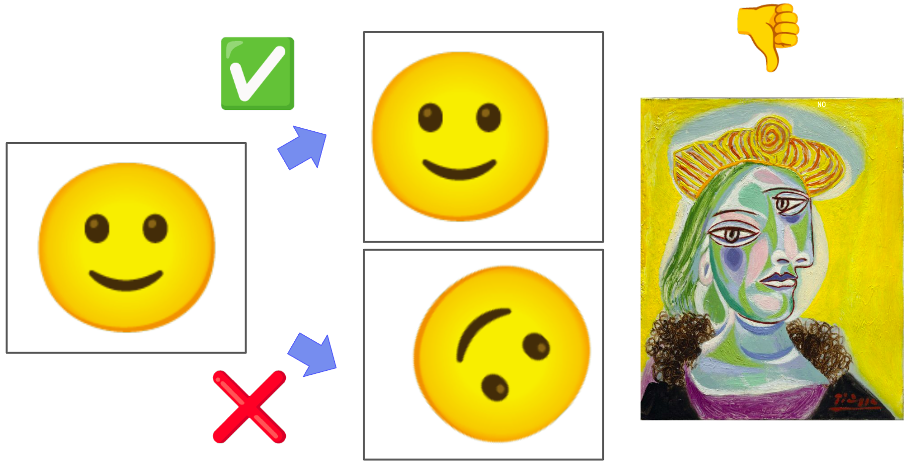

# Group Equivariant Convolutional Neural Networks and Low Coherence MLPs

<div align="center">

## 🧠🔬 Advanced Deep Learning Research  
#### 📚 University of Trieste, Academic Year 2024–2025  
#### 🎓 Data Science and Artificial Intelligence Master's Program  

[](https://github.com/luispky/AdvancedDeepLearning-UniTS)

</div>

---

<details>
<summary><strong>Table of Contents</strong> (Click to expand)</summary>

- [Group Equivariant Convolutional Neural Networks and Low Coherence MLPs](#group-equivariant-convolutional-neural-networks-and-low-coherence-mlps)
  - [🧠🔬 Advanced Deep Learning Research](#-advanced-deep-learning-research)
      - [📚 University of Trieste, Academic Year 2024–2025](#-university-of-trieste-academic-year-20242025)
      - [🎓 Data Science and Artificial Intelligence Master's Program](#-data-science-and-artificial-intelligence-masters-program)
  - [Author Information](#author-information)
  - [About the Project](#about-the-project)
    - [Project Description](#project-description)
    - [Research Questions](#research-questions)
    - [Project Structure](#project-structure)
    - [Slides](#slides)
    - [Built With](#built-with)
  - [Getting Started](#getting-started)
    - [Prerequisites](#prerequisites)
    - [Environment Configuration](#environment-configuration)
  - [Usage](#usage)
    - [Training Scripts](#training-scripts)
      - [`lightning_training.py`](#lightning_trainingpy)
      - [`mlp_training.py`](#mlp_trainingpy)
      - [`minimal_coherence_optimization_example.py`](#minimal_coherence_optimization_examplepy)
    - [Analysis Scripts](#analysis-scripts)
      - [`analyze_mlp_weights_distribution.py`](#analyze_mlp_weights_distributionpy)
    - [Visualization Scripts](#visualization-scripts)
    - [Configuration Files](#configuration-files)
  - [Results](#results)
  - [References](#references)
    - [Additional Resources](#additional-resources)
  - [Acknowledgments](#acknowledgments)

</details>

---

## Author Information

| 👤 Name        | Surname         | 🎓 Student ID | 📧 UniTS Email                                 | 📧 Gmail                |
| ------------- | --------------- | ------------ | --------------------------------------------- | ---------------------- |
| Luis Fernando | Palacios Flores | SM3800038    | luisfernando.palaciosflores@studenti.units.it | lf.palaciosf@gmail.com |

---

## About the Project

> **ℹ️ Generative Tools Notice ℹ️**  
> Generative AI tools have assisted in this project's development. Specifically, they helped to refine code readability, clarify tool functionality, fix minor bugs, write documentation, and improve overall clarity. Nonetheless, the authors remain the primary creators of the ideas and retain full ownership of the creative process.

### Project Description

🔍 This project investigates two fundamental aspects of deep learning:

1. **Group Equivariant Convolutional Neural Networks (G-CNNs)**: A natural generalization of CNNs that exploits symmetries in data to reduce sample complexity. G-CNNs use group convolutions that enjoy substantially higher weight sharing than regular convolution layers, increasing expressive capacity without increasing parameters.

2. **Low Coherence MLPs**: Investigation of frame theory principles in neural network weight matrices, exploring how low-coherence frames can improve network performance and generalization through structured weight initialization and training.

The central research questions addressed in this project are:

> **Does group equivariance improve model performance on datasets with inherent symmetries?**
> 
> **Can low-coherence frame properties enhance MLP training and generalization?**

### Research Questions

- **G-CNNs**: How do group-equivariant architectures perform compared to standard CNNs on datasets with rotational/reflectional symmetries?
- **Low Coherence MLPs**: Can frame theory principles (coherence, tightness, equiangularity) improve neural network training dynamics and final performance?
- **Optimization**: How do different regularization strategies affect frame properties during training?

### Project Structure

📂 The project is organized into the following structure:

```plaintext
├── configs/                    # Configuration files for training
│   ├── cnn.yaml              # CNN training configuration
│   ├── gcnn.yaml             # G-CNN training configuration
│   ├── mlp.yaml              # Standard MLP configuration
│   └── mlp_coherence.yaml    # Low coherence MLP configuration
├── scripts/                   # Main training and analysis scripts
│   ├── lightning_training.py  # PyTorch Lightning training pipeline
│   ├── mlp_training.py       # Low coherence MLP training
│   ├── minimal_coherence_optimization_example.py  # Frame optimization demo
│   ├── analyze_mlp_weights_distribution.py  # Weight analysis
│   └── visualize_*.py        # G-CNN visualization scripts
├── src/                      # Source code modules
│   ├── cnn.py               # CNN model implementation
│   ├── gcnn_model.py        # G-CNN model implementation
│   ├── mlp.py               # Standard MLP implementation
│   ├── low_coherence_mlp.py # Low coherence MLP implementation
│   └── datamodule.py        # Data loading and preprocessing
├── logs/                     # Training logs and results
├── plots/                    # Generated visualizations
├── results/                  # Experimental results
└── slides/                   # Presentation materials
```

### Slides

📑 View the project presentation slides [here](https://drive.google.com/file/d/1_dIzPAsDujPW6WFGJ8vSzrajHuBd6q--/view?usp=sharing).

### Built With

🛠️ This project leverages the following tools and libraries:

- 
- 
- 
- 

---

## Getting Started

Follow these steps to set up the project environment. 🚀

### Prerequisites

🐍 **Option 1: Automated Setup (Recommended)**

Use the provided setup script to automatically configure the environment with `uv`:

```bash
chmod +x shell/setup_environment.sh
./shell/setup_environment.sh
source .venv/bin/activate
```

🐍 **Option 2: Manual Conda Setup**

Alternatively, create and activate a Conda environment:

```bash
conda env create -f requirements.txt
conda activate gcnn-project
```

### Environment Configuration

<details>
<summary><strong>Click to expand for detailed environment setup instructions 🤓</strong></summary>

To ensure that all scripts run correctly, make sure your environment is set up properly:

1. **PYTHONPATH**:  
   Set the `PYTHONPATH` environment variable to include the root of this project. For example:
   ```bash
   export PYTHONPATH=$PYTHONPATH:/path/to/AdvancedDeepLearning-UniTS
   ```
   This allows Python to locate modules and packages within the project directory.

2. **Virtual Environment in PATH**:  
   Ensure the path to your virtual environment is in your `PATH`. For example:
   ```bash
   # For uv setup
   export PATH=/path/to/AdvancedDeepLearning-UniTS/.venv/bin:$PATH
   
   # For conda setup
   export PATH=/path/to/anaconda3/envs/adl-env/bin:$PATH
   ```
   This ensures you are using the correct Python interpreter and dependencies.

3. **VSCode Integration (Optional)**:  
   If you are using Visual Studio Code, you can automate these settings:
   - Create a `.env` file in the project root with:
     ```plaintext
     PYTHONPATH=/path/to/AdvancedDeepLearning-UniTS
     ```
   - Update or create `.vscode/settings.json` with:
     ```json
     {
       "python.pythonPath": "/path/to/AdvancedDeepLearning-UniTS/.venv/bin/python",
       "python.envFile": "${workspaceFolder}/.env"
     }
     ```
   This setup ensures that VSCode automatically uses your virtual environment and the specified Python path.

</details>

---

## Usage

### Training Scripts

#### `lightning_training.py`

This script provides a unified training pipeline for CNN, G-CNN, and MLP models using PyTorch Lightning. It supports automatic checkpointing, logging, and experiment tracking.

**Supported Models:**
- `mlp`: Multi-layer perceptron
- `cnn`: Convolutional neural network  
- `gcnn`: Group equivariant convolutional neural network

**Example Usage:**

```bash
# Train MLP model
python scripts/lightning_training.py --model mlp --seed 42

# Train CNN model
python scripts/lightning_training.py --model cnn --seed 42

# Train G-CNN model
python scripts/lightning_training.py --model gcnn --seed 42
```

#### `mlp_training.py`

This script implements low-coherence MLP training with frame theory principles. It supports baseline (standard cross-entropy) and coherence (with frame regularization) experiments.

**Supported Experiments:**
- `baseline`: Standard cross-entropy loss training
- `coherence`: Training with coherence loss regularization

**Example Usage:**

```bash
# Run baseline experiment
python scripts/mlp_training.py baseline --save --seed 42

# Run coherence experiment
python scripts/mlp_training.py coherence --save --seed 42
```

#### `minimal_coherence_optimization_example.py`

This script demonstrates frame coherence optimization using gradient-based methods. It shows how to optimize frame vectors to minimize coherence while maintaining frame properties.

**Example Usage:**

```bash
python scripts/minimal_coherence_optimization_example.py
```

### Analysis Scripts

#### `analyze_mlp_weights_distribution.py`

This script analyzes weight distributions across different training regimes (baseline vs. coherence) and creates comparative visualizations.

**Example Usage:**

```bash
python scripts/analyze_mlp_weights_distribution.py --models_path results/mlp/mnist/hs128_ep50 --save
```

### Visualization Scripts

The following scripts provide visualizations for G-CNN components:

- `visualize_kernel_weights.py`: Visualize learned kernel weights
- `visualize_transformed_grids.py`: Show transformed input grids
- `visualize_group_kernel_weights.py`: Display group-equivariant kernel weights
- `visualize_transformed_group_elements.py`: Visualize group element transformations

### Configuration Files

The `configs/` directory contains YAML configuration files for different model types:

- **`cnn.yaml`**: CNN training configuration with dataset options
- **`gcnn.yaml`**: G-CNN configuration with group type and order settings
- **`mlp.yaml`**: Standard MLP configuration
- **`mlp_coherence.yaml`**: Low coherence MLP with frame regularization

**Key Configuration Parameters:**

```yaml
# G-CNN specific
model:
  type: "gcnn"
  group_type: "cyclic"  # Options: cyclic, dihedral
  group_order: 4        # For cyclic: order of rotation group

# Low coherence MLP specific
loss_config:
  coherence_weight: 0.25
  lambda_softmax: 50.0
  alpha: 0.0  # Equiangularity regularization
  beta: 0.0   # Tightness regularization
```

---

## Results

**Presentation Slides**: 📑 [View Slides](https://drive.google.com/file/d/1ScihFZM4-1UZABN-tF99fN6HJTOvJ6Gj/view?usp=sharing)

All experiments were run on an **NVIDIA A100-SXM4-40GB GPU** using the [Orfeo cluster](https://orfeo-doc.areasciencepark.it/).

---

## References

[1] T. S. Cohen and M. Welling, *Group Equivariant Convolutional Networks*, arXiv preprint, arXiv:1602.07576, 2016. DOI: [10.48550/arXiv.1602.07576](https://doi.org/10.48550/arXiv.1602.07576)
[https://arxiv.org/abs/1602.07576](https://arxiv.org/abs/1602.07576)

[2] M. Thill and B. Hassibi, *Group Frames with Few Distinct Inner Products and Low Coherence*, IEEE Transactions on Signal Processing, vol. 63, no. 19, pp. 5222–5237, 2015. DOI: [10.1109/TSP.2015.2450195](https://doi.org/10.1109/TSP.2015.2450195)
[https://arxiv.org/abs/1509.05087](https://arxiv.org/abs/1509.05087)

[3] M. Thill and B. Hassibi, *Low-Coherence Frames from Group Fourier Matrices*, arXiv preprint, arXiv:1509.05739, 2015. DOI: [10.48550/arXiv.1509.05739](https://doi.org/10.48550/arXiv.1509.05739)
[https://arxiv.org/abs/1509.05739](https://arxiv.org/abs/1509.05739)

[4] E. Bekkers, *An Introduction to Equivariant Convolutional Neural Networks for Continuous Groups*, 2021. [https://uvagedl.github.io/GroupConvLectureNotes.pdf](https://uvagedl.github.io/GroupConvLectureNotes.pdf)

[5] E. Bekkers, *UvA - An Introduction to Group Equivariant Deep Learning*, 2025. [https://uvagedl.github.io/](https://uvagedl.github.io/)

### Additional Resources

* Group equivariant deep learning tutorials: [UvA Geometric Deep Learning](https://uvadlc-notebooks.readthedocs.io/en/latest/tutorial_notebooks/DL2/Geometric_deep_learning/)
* LogSumExp function: [Wikipedia - LogSumExp](https://en.wikipedia.org/wiki/LogSumExp)
* Frame theory and coherence optimization: [Frame Potential and Welch Bounds](https://en.wikipedia.org/wiki/Welch_bounds)

<p align="right">(<a href="#group-equivariant-convolutional-neural-networks-and-low-coherence-mlps">back to top</a>)</p>

---

## Acknowledgments

- [Best-README-Template](https://github.com/othneildrew/Best-README-Template?tab=readme-ov-file): for the README template
- University of Amsterdam Geometric Deep Learning Group: for educational materials on group equivariant networks
- PyTorch Lightning team: for the excellent training framework

<p align="right">(<a href="#group-equivariant-convolutional-neural-networks-and-low-coherence-mlps">back to top</a>)</p>
